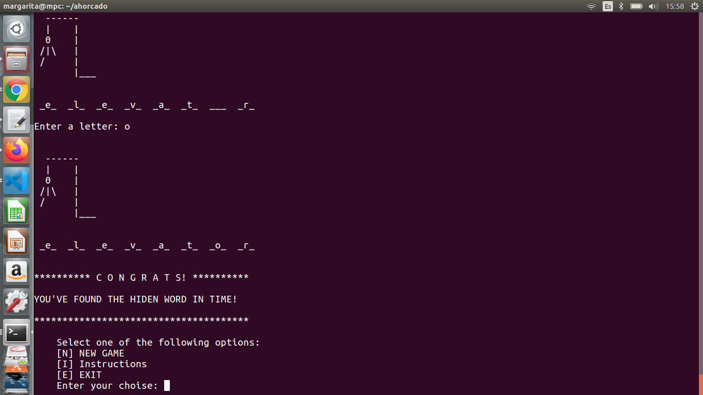

# This is 'ahorcado' game
# Would you find the word in time?

This code is inspired in a game about gessing words called 'ahorcado', here you have the instructions:

- Clone this repositoty in your pc with **python 3** installed and run **main.py**

- A figure and some empty spaces are gonna appear, the hiden word length is equal to the spaces. The game ask for 
a letter, you have to figure out one letter of the word but be careful...

- Every time you enter a wrong letter of the word, a part of the 'ahorcado' appears and when it's complete you lose:

- You win if you find the hiden word before the ahorcado appears!

